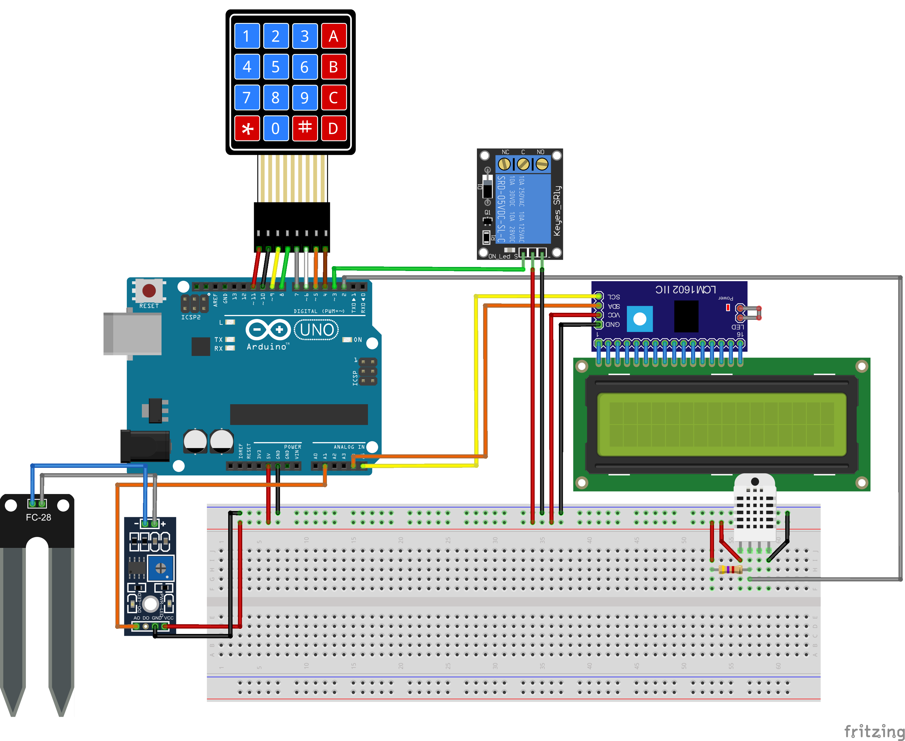
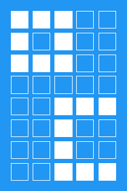
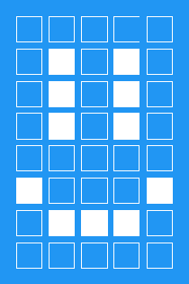

PROYECTO RIEGO INTELIGENTE CON ARDUINO
======================================

FENCYT "EUREKA" XXXIII 2023
---------------------------

### Indice

- [PROYECTO RIEGO INTELIGENTE CON ARDUINO](#proyecto-riego-inteligente-con-arduino)
  - [FENCYT "EUREKA" XXXIII 2023](#fencyt-eureka-xxxiii-2023)
    - [Indice](#indice)
    - [Resumen](#resumen)
    - [Detalles de Hardware](#detalles-de-hardware)
    - [Documentación](#documentación)
      - [1. Dependencias](#1-dependencias)
      - [2. Variables globales](#2-variables-globales)
      - [3. Datos guardados en EEPROM:](#3-datos-guardados-en-eeprom)
      - [4. Funciones:](#4-funciones)
      - [5. Comandos del numpad:](#5-comandos-del-numpad)
      - [6. Lanzamiento:](#6-lanzamiento)
      - [7. Actualizaciones pendientes:](#7-actualizaciones-pendientes)

### Resumen

El proyecto *"Riego inteligente"* es un proyecto que fue hecho para la **Feria Nacional de Ciencia y Tecnología (FENCYT) "EUREKA"**.

En este repositorio se encuentra los detalles técnicos del proyecto hecho por los estudiantes del 4to Grado B del colegio:  
**Martin de la Riva y Herrera** de la ciudad de *Lamas, Lamas, San Martin*.

Este proyecto esta basado en el microcontrolador ARDUINO UNO, y todo el código esta basado en C++ ya que es el lenguaje que usa el compilador de ARDUINO para el respectivo microcontrolador.

### Detalles de Hardware

Este proyecto usa un ARDUINO UNO basado en el microprocesador ATmega328p.  
A este microcontrolador es que se conecta el resto de periféricos que se encargaran de recopilar y mostrar los datos e información necesaria.  

Los componentes conectado al ARDUINO y sus respectivos pines a continuación:

- SENSOR DE HUMEDAD DE SUELO **YL-69**: **PIN A3**
- SENSOR DE HUMEDAD Y TEMPERATURA DEL AIRE **DHT-22**: **PIN 2**
- RELÉ MECÁNICO DE 5V PARA CONTROL: **PIN 3**
- PANTALLA LCD I2C 16X2:
    - **SCL: PIN A5**
    - **SDA: PIN A4**
- TECLADO NUMÉRICO **NUMPAD 4x4**:
    - **FILAS: PINES 11, 10, 9, 8**
    - **COLUMNAS: PINES 7, 6, 5, 4** 

Se puede ver mas detalles de los esquemáticos usando el programa FRITZING para ver los archivos del fichero `fritzing_schematics`

### Documentación

#### 1. Dependencias

Desde la linea 1 a la linea 11 se importan las librerías necesarias para varias de las funciones del programa en ARDUINO.  
Estas se consideran dependencias del programa, por lo cual sin estas librerías instaladas el programa es incapaz de compilarse.

> Permite el correcto funcionamiento de los pines I2C para la pantalla LCD

    // Bibliotecas para pantalla LCD I2C
    #include <Wire.h>
    #include <LCD.h>
    #include <LiquidCrystal_I2C.h>

> Permite la fácil recolección de datos de cualquier sensor DHT-XX

    // Bibliotecas para sensor de humedad y temperatura ambiental
    #include <DHT.h>
    #include <DHT_U.h>

> Permite el eficiente manejo de la EEPROM de ARDUINO

    // Biblioteca para modificar y leer la memoria EEPROM
    #include <EEPROM.h>

> Permite simplificar el uso del keypad

    // Biblioteca para control sencillo del numpad 4x4
    #include <Keypad.h>

#### 2. Variables globales

En esta sección del código se inicializan u obtienen las variables globales necesarias para el programa y a las cuales se accederá y modificara en cualquier parte del código:

> Definiciones para los pines de los componentes conectados al ARDUINO.

    // Definiciones de los pines de entradas y salidas
    #define HUMIDITY_SENSOR_PIN A1
    #define RELAY_PIN 3
    #define DHT_PIN 2

> Estos valores son los que se obtienen con el sensor en aire y sensor sumergido en agua, los cuales se usaran de referencia para sacar el porcentaje de humedad.
> 
> Estos valores se guardan en la EEPROM de ARDUINO para poder mantener los valores aun después de cortar la energía eléctrica.

    // Valores de calibración del sensor de humedad del suelo
    int airValue = EEPROM.get(0, airValue);     // Valor que da el sensor de humedad del suelo en el aire (Su valor se guarda en 0)
    int waterValue = EEPROM.get(4, waterValue); // Valor que da el sensor de humedad del suelo en el agua (Su valor se guarda en 4)

> Las variables donde se almacenaran la entrada analógica como porcentual del sensor de humedad de suelo.

    int soilMoistureRaw;
    int soilMoisturePercent;

> Valores de temperatura y humedad del sensor DHT-22

    int temperature;
    int humidity;

> Valores de máxima y mínima humedad para el riego automático, los cuales se guardan en la EEPROM para que se puedan cambiar sin riesgo a perderlos al reiniciar el ARDUINO.

    int minHumidity = EEPROM.get(8, minHumidity);
    // Valor de limite mínimo de humedad en suelo (Su valor se guarda en 8)

    int maxHumidity = EEPROM.get(12, maxHumidity);
    // Valor de limite máximo de humedad en suelo (Su valor se guarda en 12)

> Valores de humedad porcentual del suelo, humedad y temperatura ambiental del ciclo anterior, para ciertas verificaciones que lo requieren

    int preSoilMoisturePercent;
    int preTemperature;
    int preHumidity;

> Booleano que dice si esta regando o no

    boolean wateringState = false;

> Booleano que dice si la luz de fondo de la LCD esta encendida o no

    boolean backlightLCD = true;

> Carácter personalizado para representar los grados Celsius debido a que el símbolo de grados "°" no es renderizado por la pantalla LCD.  
>
> 

    byte celsiusGrades[] = {
        B11100,
        B10100,
        B11100,
        B00000,
        B00111,
        B00100,
        B00100,
        B00111};

> Carácter personalizado de una cara sonriente para la bienvenida al programa.
>
> 

    byte welcomeFace[] = {
        B00000,
        B01010,
        B01010,
        B01010,
        B00000,
        B10001,
        B01110,
        B00000};

> Constantes del número de filas y columnas que tiene el numpad

    // Número de filas y columnas del numpad
    const byte ROWS = 4;
    const byte COLUMNS = 4;

> Arreglo de las teclas del numpad

    // Teclas del numpad
    char keys[ROWS][COLUMNS] = {
        {'1', '2', '3', 'A'},
        {'4', '5', '6', 'B'},
        {'7', '8', '9', 'C'},
        {'*', '0', '#', 'D'}};

> Pines del numpad para las filas y las columnas

    // Pines del numpad
    byte rowPins[ROWS] = {11, 10, 9, 8};
    byte columnPins[COLUMNS] = {7, 6, 5, 4};

> Inicializador para el keypad 4x4

    Keypad numpad = Keypad(makeKeymap(keys), rowPins, columnPins, ROWS, COLUMNS);

> Inicializador para el sensor DHT-22

    DHT dht(DHT_PIN, DHT22);

> Inicializador para la pantalla LCD I2C

    LiquidCrystal_I2C lcd(0x27, 2, 1, 0, 4, 5, 6, 7);

#### 3. Datos guardados en EEPROM:

Este programa usa la memoria EEPROM integrada en el ARDUINO UNO para almacenar los siguientes datos:
- Dirección 0: Valor del sensor de humedad del suelo en el aire `airValue`
- Dirección 4: Valor del sensor de humedad del suelo en el agua `waterValue`
- Dirección 8: Limite inferior del rango de humedad para el suelo `minHumidity`
- Dirección 12: Limite superior del rango de humedad para el suelo `maxHumidity`

#### 4. Funciones:

Vamos a señalar cada función o método del código con una pequeña descripción de lo que hace cada uno:

1. `void setup()`  
Se inicializa el sensor DHT-22  
Se inicializa el pin del relé en `OUTPUT MODE` y se desactiva el relé.  
Se inicializa la pantalla LCD y se agrega el carácter de grados Celsius y la cara sonriente a su memoria.
Imprime la pantalla de inicio.

1. `void loop()`  
El código dentro de esta función se repetirá indefinidamente debido a la estructura de ejecución del ARDUINO.  
Esta repetición sera cada 250ms debido al `delay(500)` que esta al final de la función.  
En esta función se llamara a otras funciones que cumplan el rol de:
    - Mostrar datos en pantalla.
    - Recolectar los datos de los sensores.
    - Verificar y comparar datos entre si.
    - Solicitar la entrada del numpad.
    - Etc.

1. `void showAmbientData()`  
Muestra en la pantalla LCD toda la información ambiental de los sensores.

1. `void watering()`  
Verifica si la humedad del suelo es inferior a `minHumidity`, que representa el mínimo de humedad del rango, de ser este el caso, encenderá el relé hasta ser igual o superior a `maxHumidity`, dejando espacio para lo que se demore en apagar la bomba que este conectado al relé y el agua que seguía recorriendo el tubo.  
Cuando se complete el riego apagara el relé y se situara el estado de riego en `false`

1. `void wateringMsj()`  
Muestra en pantalla el mensaje de que se esta rengando en ese momento y la humedad del suelo actual.

1. `void optionSelector()`  
A cada ciclo del `loop()` se encarga de verificar si en ese momento se esta presionando una tecla del teclado, y de ser ese el caso, ver si la tecla esta configurada para alguna opción del sistema.

1. `void showHumidityRange(int msDelay)`  
Recibe como parámetro un delay en mili-segundos.  
Esta función desactiva el relé hasta que se termina de ejecutar, muestra el mínimo y máximo del rango de humedad con su respectiva etiqueta.  
Esta información se mostrara durante la cantidad de mili-segundos ingresada como parámetro.

1. `void setHumidityRange()`  
Desactiva el relé, imprime el mensaje en LCD solicitando ingresar los datos para el rango de humedad.  
Activa el bloque parpadeante para representar la espera de ingreso de datos, registra los botones numéricos presionados para guardar el número de los limites del rango, los imprime en pantalla y verificara que sea un valor valido para el porcentaje.

1. `void invalidValueHumidityScreen()`  
Muestra en la pantalla LCD un mensaje de `INGRESE UN VALOR VALIDO`

1. `void calibrateSoilSensor()`  
Inicia la calibración del sensor de humedad del suelo, solicitando al usuario que coloque el sensor en el aire y en el agua y confirme entre cada acción para guardar los datos analógicos de cada muestra y los use de referencia para el máximo y mínimo de humedad y los guarda en la EEPROM

1. `void toggleBacklightLCD()`  
Cambia el estado del LED de la luz de fondo de la pantalla LCD y lo guarda en el booleano `backlightLCD` para saber si la pantalla esta encendida o no.

1. `void startScreen()`  
Imprime en pantalla el mensaje `INICIALIZANDO` y una cara sonriente.

1. `int condicionalClearLCDByNumberInLCD(int number, int preNumber)`  
Recibe como entrada el valor actual de la variable y su valor anterior, los compara entre si para verificar si se redujo la cantidad de caracteres de los valores mostrados, de ser el caso, borrara la pantalla para evitar dejar caracteres fantasmas.

1. `int fixPercent(int toFix)`  
Recibe de entrada un número porcentual que debe ser verificado para que no salga de los limites de 0% - 100%, y regresa el número ya corregido.

1. `boolean percentChecker(int percentToCheck)`  
Recibe como parámetro un valor numérico para verificar si esta dentro del rango de 0% - 100%  
Devolverá `true` o `false` dependiendo si cumple la condición.

1. `void debuggingSoilMoisture()`   
Imprime por puerto serie las variables `soilMoisturePercent` y `soilMoistureRaw` para permitir una depuración del sensor de humedad de suelo.

1. `void debuggingEEPROMData()`  
Inicia el puerto Serial e imprime los valores de:
    - `EEPROM.length()`
    - `airValue`
    - `waterValue`
    - `minHumidity`
    - `maxHumidity`

Estos valores se imprimen para ver sus datos debido a que se guardan en la EEPROM del ARDUINO y en caso de error permitirá ver cual dato es el que falla.

#### 5. Comandos del numpad:

Los comandos que se pueden ejecutar actualmente son:
- [A] Ver el rango actual de humedad || Aceptar
- [B] Modificar el rango de humedad
- [C] Calibración del sensor || Cancelar
- [D] Apagar / encender la pantalla

#### 6. Lanzamiento:

Para lanzar este programa solo tienes que tener el IDE de ARDUINO y las bibliotecas referenciadas en el punto 1, conectar el ARDUINO UNO al equipo, compilar el programa y cargarlo al ARDUINO.

Procurar conectar los componentes al pin correspondiente en el código o caso contrario reemplazar el `#define` dentro del código por el pin que este usando.

Los enlaces a los recursos para ejecutar el código son:  
- [Arduino IDE](https://www.arduino.cc/en/software)
- [New Liquid-Crystal](https://github.com/fmalpartida/New-LiquidCrystal)
- [DHT Sensor Library](https://github.com/adafruit/DHT-sensor-library)
- [Keypad](https://playground.arduino.cc/Code/Keypad/)
- Wire.h (Incluida en el IDE)
- EEPROM.h (Incluida en el IDE)

#### 7. Actualizaciones pendientes:

- [X] ~~Agregar num-pad 4x4~~
- [X] ~~Agregar posibilidad de ver el rango actual.~~
- [X] ~~Modificar el rango de humedad desde el num-pad.~~
- [X] ~~Permitir calibración del sensor de humedad de suelo desde el num-pad.~~
- [X] ~~Permitir desactivar o activar la luz de fondo de la LCD.~~
- [ ] Refactorizar y optimizar el código para mejor legibilidad.
